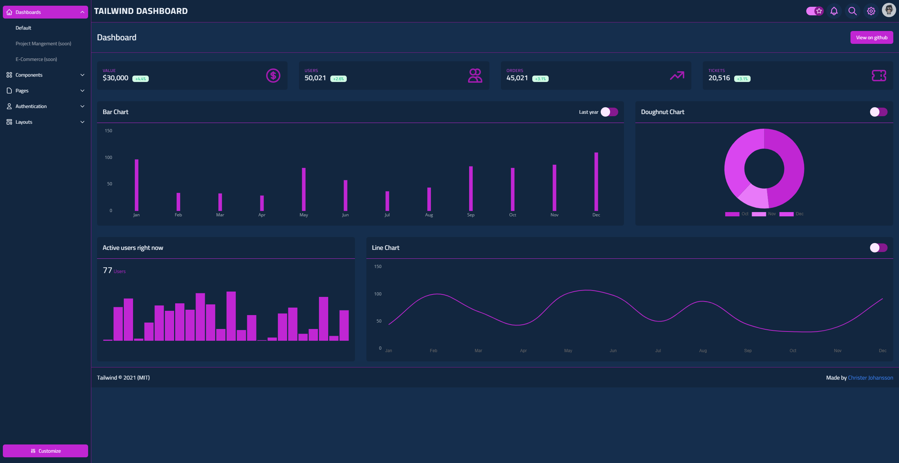

# Tailwind Dashboard

Fully responsive Tailwind dashboard template with Tailwind CSS & Alpine.js

[](https://github.com/christerjohansson/starter-dashboard-layout/blob/main/License.md)
[](https://img.shields.io/github/languages/code-size/christerjohansson/tailwind-dashboard?style=for-the-badge)
[](https://img.shields.io/github/release-date/christerjohansson/tailwind-dashboard?style=for-the-badge)
[](https://img.shields.io/github/package-json/v/christerjohansson/tailwind-dashboard?style=for-the-badge)

## [See live](https://christerjohansson.github.io/tailwind-dashboard/)

## Screenshot


To get started:

1. Clone the repository:

   ```bash
   git clone https://github.com/christerjohansson/tailwind-dashboard.git

   cd tailwind-dashboard
   ```

2. Install the dependencies:

   ```bash
   # Using npm
   npm install

   # Using Yarn
   yarn
   ```

3. Start the development server:

   ```bash
   # Using npm
   npm run serve

   # Using Yarn
   yarn serve
   ```

   Now you should be able to see the project running at localhost:8080.

4. Open `public/index.html` in your editor and start experimenting!

## Building for production

To build an optimized version of your CSS, simply run:

```bash
# Using npm
npm run prod

# Using Yarn
yarn prod
```

After that's done, check out `./public/build/css/tailwind.css` to see the optimized output.

